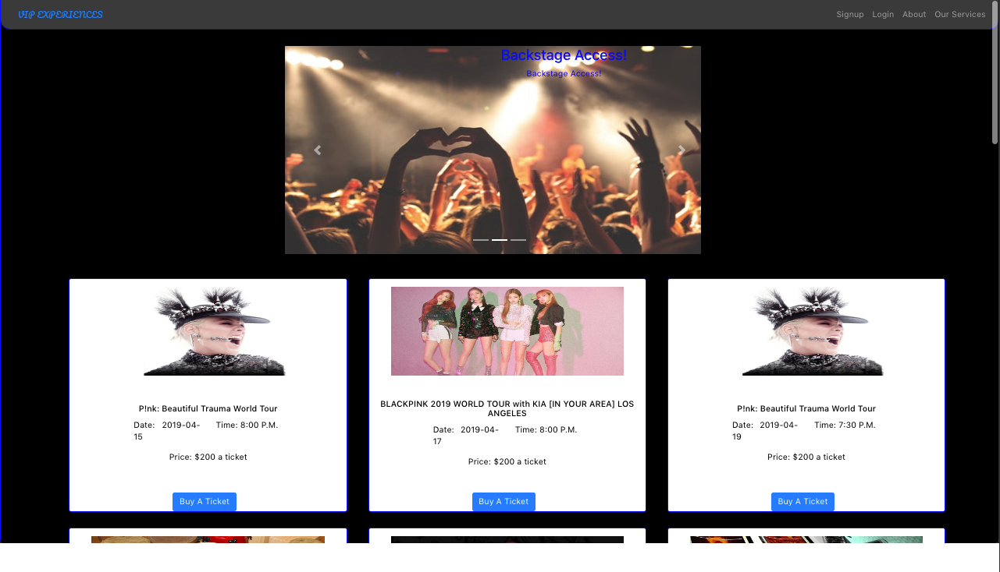
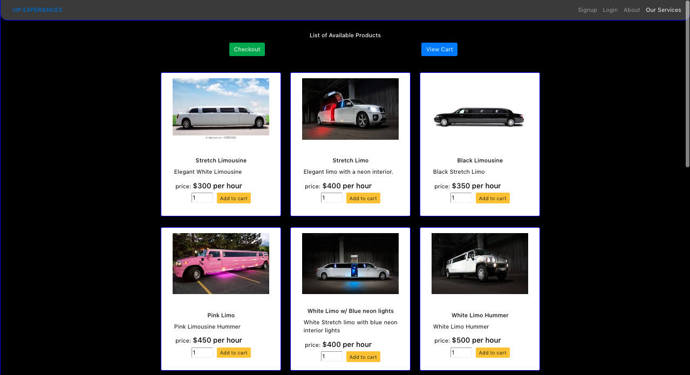

## VIP Experiences
The idea behind VIP Experiences is to provide music lovers, in or visiting the Los Angeles area, with a custom VIP experience surrounding music concerts. Users will be able to purchase tickets  to concerts in Los Angeles and then go on to build their own custom VIP package including but not limited to: limo  rentals, party bus rentals, bottle service, cigars and much more!

## Screenshots 

      
      

  
  
## Lessons Learned
During this project I learned about React in general as this was my first project using React. Specifically I learned about React components, state and props. I also learned  to build a full-stack React application. I also learned how to integrate React with API data.  
  
  
## Technologies Used
MongoDB     
Express     
ReactJS     
NodeJS      
JWT (JSON Web Tokens)    
  
## Third Party Sources Used
Ticketmaster API
React Shopping Cart ( 3rd party )  
  
## APP Links
Visit VIP Experiences Trello Board [here](https://trello.com/b/4vc6Hh5w/wdi-project-4)  
Visit VIP Experiences Github Page [here](https://trello.com/b/4vc6Hh5w/wdi-project-4)  

Want to see the app in action?  click [here](https://vipexperiences.herokuapp.com) 

## Future Improvements
